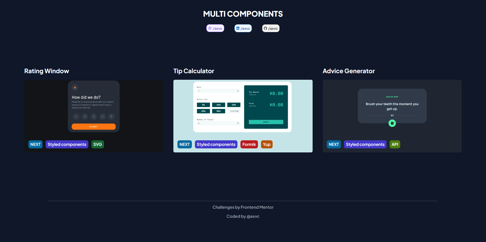
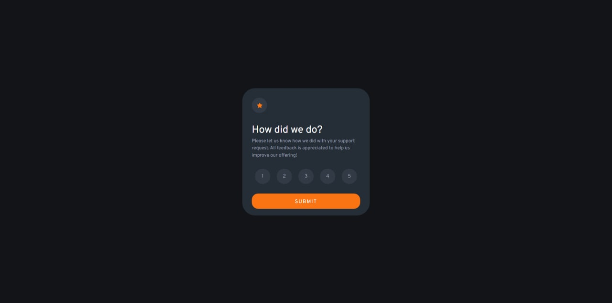
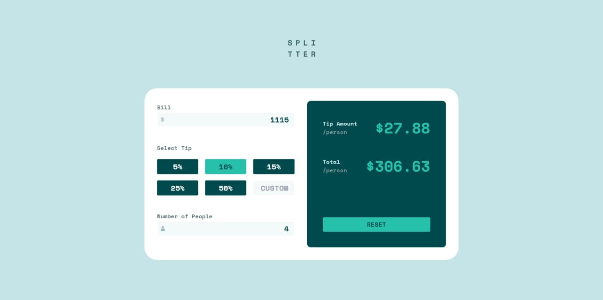
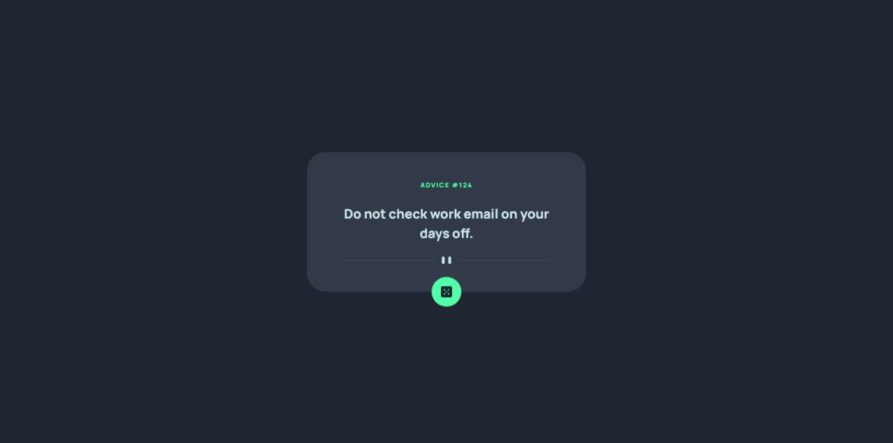

# Multi components

The collection of three applications with different functionality and technologies.

## Table of contents

- [Overview](#overview)
    - [The challenge](#the-challenge)
    - [Screenshot](#screenshot)
- [Components](#components)
    - [Rating Window](#rating-window)
        - [The challenge](#the-challenge)
        - [Screenshot](#screenshot)
    - [Tip Calculator](#tip-calculator)
        - [The challenge](#the-challenge)
        - [Screenshot](#screenshot)
    - [Advice Generator](#advice-generator)
        - [The challenge](#the-challenge)
        - [Screenshot](#screenshot)
- [My process](#my-process)
    - [Built with](#built-with)

## Overview

### The challenge

Users should be able to:

- View any of the three components included in the project
- Interact with buttons to contact the author

### Screenshot

## Components

### Rating Window

This is a solution to the [Interactive rating component challenge on Frontend Mentor](https://www.frontendmentor.io/challenges/interactive-rating-component-koxpeBUmI).

#### Challenge

Users should be able to:

- View the optimal layout for the app depending on their device's screen size
- See hover states for all interactive elements on the page
- Select and submit a number rating
- See the "Thank you" card state after submitting a rating

#### Screenshot

### Tip Calculator

This is a solution to the [Tip calculator app challenge on Frontend Mentor](https://www.frontendmentor.io/challenges/tip-calculator-app-ugJNGbJUX).

#### Challenge

Users should be able to:

- View the optimal layout for the app depending on their device's screen size
- See hover states for all interactive elements on the page
- Calculate the correct tip and total cost of the bill per person

#### Screenshot

### Advice Generator

This is a solution to the [Advice generator app challenge on Frontend Mentor](https://www.frontendmentor.io/challenges/advice-generator-app-QdUG-13db).

#### Challenge

Users should be able to:

- View the optimal layout for the app depending on their device's screen size
- See hover states for all interactive elements on the page
- Generate a new piece of advice by clicking the dice icon

#### Screenshot

## My process

### Built with

- [Typescript](https://www.typescriptlang.org/) - Main language
- [React](https://reactjs.org/) - JS/TS library
- [Next](https://nextjs.org/) - React Framework
- [Styled Components](https://styled-components.com/) - For styles
- [Tailwind](https://tailwindcss.com/) - For styles
- [Formik](https://formik.org/) - Form library
- [Yup](https://www.npmjs.com/package/yup) - Object schema validator
- [Node.js](https://nodejs.org/en/) - BackEnd Language
- [ESLint](https://eslint.org/) - Linter
